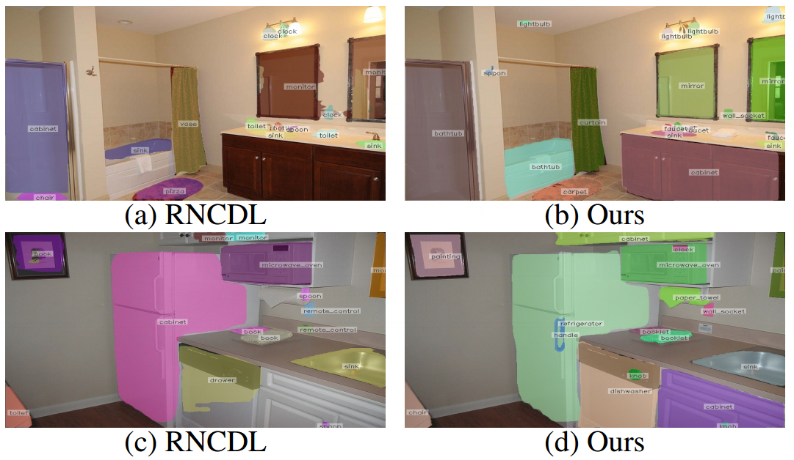
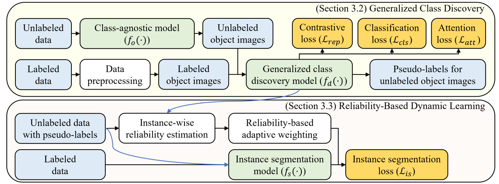

<div align="center">

## Generalized Class Discovery in Instance Segmentation <br> (AAAI 2025)

[Cuong Manh Hoang](https://scholar.google.com/citations?user=7sUs5o8AAAAJ&hl=en), [Yeejin Lee](https://ieeexplore.ieee.org/author/37075435600), [Byeongkeun Kang](https://scholar.google.com/citations?user=YvKVr0UAAAAJ&hl=en)


[Paper]() | [Source code](https://github.com/CuongHoang86/Generalized-Class-Discovery-in-Instance-Segmentation/tree/main) | [Poster]() 
</div>

**What is it?** In generalized class discovery in instance segmentation, it assumes that the unlabeled data may contain both known and novel classes, making the problem more challenging and realistic. Given labeled and unlabeled data, the model is trained to recognize both the known classes in the labeled data and the novel categories discovered from the unlabeled data.

<div align="center">
  
</div>


**How we do it?** In our framework, we first utilize an open-world instance segmentation model [GGN](https://github.com/facebookresearch/Generic-Grouping), pretrained with class-agnostic masks of known classes, to segment class-agnostic masks of unknown classes. Then, the objects of known and unknown classes are cropped to make a new object dataset. In this dataset, object images of known classes contain their categories and object images of unknown classes do not contain their categories. To cluster object images of unknown classes, we propose a generalized class discovery model with a novel instance-wise temperature assignment and a novel soft attention module. Finally, masks and categories of all objects are used to train the instance segmentation model [SOLO](https://github.com/WXinlong/SOLO) with a novel reliability-based dynamic learning. 

<div align="center">
   <br/>
</div>


## Installation
This implementation is based on [mmdetection](https://github.com/open-mmlab/mmdetection)(v1.0.0). All the additional dependencies we put to requirements.txt. We used Python 3.8 for all experiments.

## Download datasets
Please follow [RNCDL](https://github.com/vlfom/RNCDL/tree/main) to download data.

## Citation
If you find our paper useful in your research or reference it in your work, please star our repository and use the folowing:
```bibtex
```
